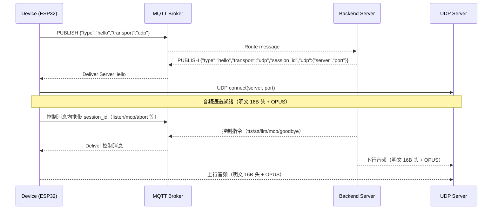

# MQTT+UDP 握手流程说明（简化版，保留 session_id）

本文档说明在“udp”模式下，设备端与服务端的握手流程、收发内容和解析规则。该模式：
- 保留 MQTT 控制通道
- UDP 音频通道为明文，固定使用 OPUS(16kHz, 60ms, mono)
- 保留 session_id，用于控制通道会话绑定


## 1. 固定约定

- 音频参数（上下行一致，强制对齐）：
  - format: opus
  - sample_rate: 16000
  - frame_duration: 60（ms）
  - channels: 1
- 通道划分：
  - 控制通道：MQTT（JSON 文本）
  - 音频通道：UDP（明文，16字节包头 + OPUS payload）

## 2. 消息格式（握手）

### 2.1 设备 → 服务端：Hello（MQTT 文本）
主题：设备的 publish_topic（Settings("mqtt").publish_topic）

```json
{
  "type": "hello",
  "transport": "udp"
}
```

### 2.2 服务端 → 设备：ServerHello（MQTT 文本）
主题：投递到设备订阅主题（由 Broker/后端路由）

```json
{
  "type": "hello",
  "transport": "udp",
  "session_id": "xxxx-uuid",
  "udp": {
    "server": "1.2.3.4",
    "port": "xxxx"
  }
}
```

- 必需字段：type, transport, udp.server, udp.port
- 建议保留：session_id（后续控制消息绑定会话）


### 2.3 会话结束（可选）服务端 → 设备：Goodbye（MQTT 文本）
```json
{
  "type": "goodbye",
  "session_id": "xxxx-uuid"
}
```

## 3. 握手时序



## 4. 设备端行为与解析

- 发送 Hello：仅携带 `type=hello` 与 `transport=udp`
- 等待 ServerHello（超时 10s）：
  - 读取 `session_id`（如果存在）并保存
  - 读取 `udp.server` / `udp.port`，作为 UDP 目标
  - 音频参数固定设置为 16k/60ms（不解析 audio_params）
- 打开 UDP 通道：connect(server, port)
- 音频上传：按固定 16B 头 + OPUS 明文发送
- 音频接收：解析 16B 头后直接拷贝 payload 到解码器

设备端使用的默认/固定参数：
- 上行编码：OPUS(16000Hz, 60ms, mono)
- 下行解码期望：OPUS(16000Hz, 60ms, mono)，如服务端不同步将导致解码异常

## 5. 服务端行为与解析

- 接收 Hello（MQTT）：
  - 生成 `session_id`
  - 选择/分配一个 UDP 监听端口（或返回当前网关地址与端口）
  - 回复 ServerHello（最小集：transport、session_id、udp.server/port）
- 绑定会话：将 `session_id` 与当前设备控制通道、以及后续 UDP 源地址关联
- UDP 上行：
  - 按 16B 头解析（见下文）
  - 用 `sequence` 检测丢包/乱序（seq < last 丢弃；seq > last+1 记丢包日志）
  - `timestamp` 可用于延迟统计或服务端 AEC 对齐
- UDP 下行：
  - 构造同样 16B 头并发送 OPUS 明文
  - 建议与上行一致使用相对时间轴（0,60,120,…ms）

## 6. UDP 音频包（明文）

固定 16 字节包头（网络字节序）+ OPUS payload：

```
+--------+--------+--------+--------+--------+--------+--------+--------+
| type   | flags  |    payload_len    |           ssrc            |
|  (1B)  |  (1B)  |       (2B)        |           (4B)            |
+--------+--------+--------+--------+--------+--------+--------+--------+
|                    timestamp (4B, ms)                 |
+--------+--------+--------+--------+--------+--------+--------+--------+
|                    sequence (4B)                      |
+--------+--------+--------+--------+--------+--------+--------+--------+
|                         OPUS payload (payload_len B)               |
+--------+--------+--------+--------+--------+--------+--------+--------+
```

- `type`: 固定 0x01
- `flags`: 保留 0x00
- `payload_len`: 后续 OPUS 数据长度
- `ssrc`: 保留（可 0）
- `timestamp`: 毫秒，相对时间轴（0, 60, 120, ...）
- `sequence`: 自增序号（从 1 开始）

接收端处理建议：
- 长度校验：`data.size() >= 16 + payload_len`
- 丢包/乱序：
  - 如果 `seq < last_seq`：丢弃旧包
  - 如果 `seq != last_seq + 1`：记丢包/乱序日志
- 解码：将 payload 作为 OPUS 数据喂入解码器

## 7. 控制通道（需携带 session_id）

设备 → 服务端：
- 开始监听：
```json
{"session_id":"xxxx-uuid","type":"listen","state":"start","mode":"auto"}
```
- 停止监听：
```json
{"session_id":"xxxx-uuid","type":"listen","state":"stop"}
```
- 中止说话：
```json
{"session_id":"xxxx-uuid","type":"abort","reason":"wake_word_detected"}
```
- MCP：
```json
{"session_id":"xxxx-uuid","type":"mcp","payload":{}}
```

服务端 → 设备：
- TTS：
```json
{"type":"tts","state":"start"}
{"type":"tts","state":"sentence_start","text":"你好"}
{"type":"tts","state":"stop"}
```
- 其它（stt/llm/mcp/system/alert 等）保持既有格式

## 8. 超时与错误

- 握手超时：等待 ServerHello 10s 超时 → 设备反馈 SERVER_TIMEOUT 并回退
- 通道超时：120s 未收到任何数据（控制或音频） → 视为超时
- 包校验失败：长度 <16、type 非 0x01、payload_len 不一致 → 丢弃并记录

## 9. 安全与保活

- 明文仅建议用于内网/可控环境；服务端应做 ACL、限速、白名单
- NAT 保活：静音期建议定期发送最小包（或服务端下行最小帧）维持映射

---

本文档适用于“udp（无加密）”模式.
